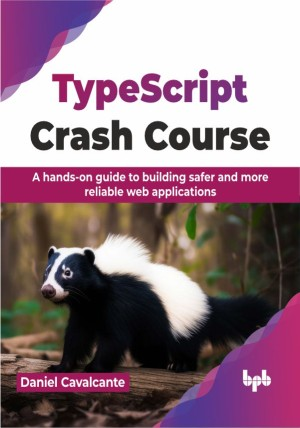

# TypeScript Crash Course

Build scalable and reliable web applications with TypeScript

This is the repository for [TypeScript Crash Course
](https://bpbonline.com/products/typescript-crash-course?variant=43676741042376),published by BPB Publications.

## About the Book
Navigating the dynamic landscape of web development can be a daunting task, "TypeScript Crash Course" is a guide to help you on the journey of mastering TypeScript, one of today's most sought-after skills in the tech market. 

Starting from the basics and core principles to gradually building up to more advanced concepts, this book will help you move to practical examples of converting an application from JavaScript, React, and Node to TypeScript. This book also offers insights into leveraging TypeScript for both front-end and back-end development, ensuring readers can tackle any project with confidence, from development to deployment.

This guide is not just about learning a new programming language; it is about enhancing your career in the tech industry by building more reliable applications. This book focuses on applying TypeScript in diverse practical scenarios to significantly shorten your learning curve. It also dispels common myths and misconceptions about TypeScript, equipping you with the knowledge to navigate your career paths successfully.

## What You Will Learn
• Master TypeScript fundamentals and more advanced concepts to develop scalable web applications.

• Transition seamlessly from JavaScript to TypeScript, enhancing code reliability and maintainability.

• Apply TypeScript in real-world scenarios, such as migrating JavaScript applications, designing user interfaces with React, and developing server-side applications with Node.

• Understand and implement advanced TypeScript features, such as generics and decorators.

• Selecting the right tools and frameworks to boost project efficiency and performance.
